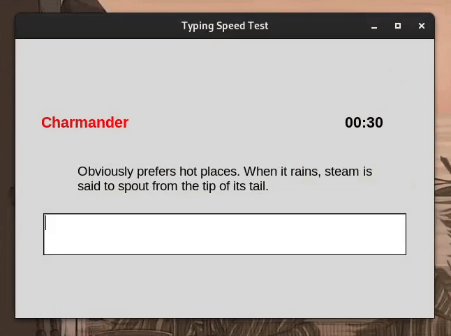

# Typing Speed Test

A Tkinter GUI desktop application which tests your typing speed.



## Table of Contents

- [Features](#features)
- [Installation](#installation)
- [Usage](#usage)
- [Contributing](#contributing)
- [License](#license)

## Features

- Fetches text data from [pokeapi](https://pokeapi.co) to provide a variety of typing exercises.
- Calculates typing accuracy and typing speed in words per minute (WPM).
- User-friendly graphical interface built with Tkinter.

## Installation

1. Clone this repository to your local machine:

```bash
git clone https://github.com/alexkanavos/typing-speed-test
```

2. Navigate to the project directory:

```bash
cd typing-speed-tester
```

3. Install required dependencies:

```bash
pip install -r requirements.txt
```

## Usage

1. Run the application by executing the following command in your terminal:

```bash
python3 main.py
```

2. The application window will appear, providing you with a typing exercise fetched from pokeapi.
3. Type the displayed text in the provided input field.
4. Your accuracy, your typing speed in words per minute (WPM) and the total time spent will be displayed.
5. You can choose to do another typing exercise by clicking the "Restart" button.

## Contributing

Contributions are welcome! If you'd like to contribute to this project, feel free to fork the repository and submit a pull request with your changes.

## License

This project is licensed under the [MIT License](LICENSE).
